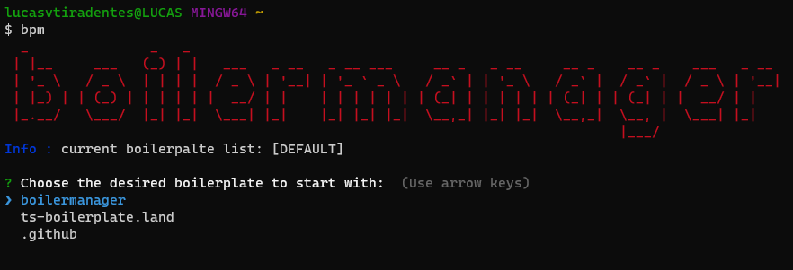

<a name="TOC"></a>

<p align="center">
  
</p>

<div align="center">
  <a href="https://www.npmjs.com/package/boilermanager"></a>
  <a href=""></a>
  <a href="https://www.github.com/ts-boilerplate-land/boilermanager/commits/master"></a>
  <br>
  <a href="https://www.github.com/lucasvtiradentes"></a>
  <a href="#"></a>
  <a href="https://gitter.im/ts_boilerplate_land/community"></a>
</div>

<p align="center">
  <a href="#dart-features">Features</a> • <a href="#warning-requirements">Requirements</a> • <a href="#bulb-usage">Usage</a> • <a href="#wrench-development">Development</a> • <a href="#pray-help">Help</a> • <a href="#books-about">About</a> • <a href="#family-community">Community</a>
</p>

<details>
  <summary align="center"><span>see <b>all badges</b></span></summary>
  <p align="center">
    <br>
    <a href="#"></a>
    <a href="https://github.com/ts-boilerplate-land/boilermanager/graphs/contributors"></a>
    <br>
    <a href="#"></a>
    <a href="https://saythanks.io/to/lucasvtiradentes"></a>
    <a href="#"></a>
  </p>
  <p align="center">
    <br>
    <a href="https://github.com/commitizen/cz-cli"></a>
    <a href="https://gitmoji.dev"></a>
    <a href="https://github.com/semantic-release/semantic-release"></a>
    <br>
    <a href="https://git-scm.com/"></a>
    <a href="https://github.com/"></a>
    <a href="https://www.typescriptlang.org/"></a>
  </p>
  <p align="center">
    <br>
    <a href="https://github.com/ts-boilerplate-land/boilermanager/releases"></a>
    <a href="https://github.com/ts-boilerplate-land/boilermanager/tags" target="_blank"></a>
    <br>
    <a href="https://github.com/ts-boilerplate-land/boilermanager/pulls" target="_blank"></a>
    <a href="https://github.com/ts-boilerplate-land/boilermanager/commits/master" target="_blank"></a>
    <a href="https://github.com/ts-boilerplate-land/boilermanager/issues"></a>
    <a href="https://github.com/ts-boilerplate-land/boilermanager/issues?q=is%3Aissue+is%3Aclosed"></a>
  </p>
</details>

<details>
  <summary align="center"><span>see <b>table of content</b></span></summary>
  <p align="center">
    <ul>
      <!-- <li><a href="#trumpet-overview">Overview</a></li> -->
      <!-- <li><a href="#pushpin-table-of-contents">TOC</a></li> -->
      <li><a href="#dart-features">Features</a></li>
      <li><a href="#warning-requirements">Requirements</a></li>
      <li>
        <a href="#bulb-usage">Usage</a>
        <ul>
          <li><a href="#installation">Installation</a></li>
          <li><a href="#commands">Commands</a></li>
          <li><a href="#tips-and-tricks">Tips and tricks</a></li>
        </ul>
      </li>
      <li>
        <a href="#wrench-development">Development</a>
        <ul>
          <li><a href="#development-setup">Development setup</a></li>
          <li><a href="#folders-and-files-structure">Folders and files structure</a></li>
          <li><a href="#used-technologies">Used technologies</a></li>
          <li><a href="#code-style">Code style</a></li>
          <li><a href="#commit-messages-style">Commit messages style</a></li>
          <li><a href="#tests">Tests</a></li>
        </ul>
      </li>
      <li>
        <a href="#pray-help">Help</a>
        <ul>
          <li><a href="#faq">FAQ</a></li>
          <li><a href="#docs-and-support">Docs and support</a></li>
        </ul>
      </li>
      <li>
        <a href="#books-about">About</a>
        <ul>
          <li><a href="#roadmap">Roadmap</a></li>
          <li><a href="#related">Related</a></li>
          <li><a href="#license">License</a></li>
        </ul>
      </li>
      <li>
        <a href="#family-community">Community</a>
        <ul>
          <li><a href="#contributing">Contributing</a></li>
          <li><a href="#feedback">Feedback</a></li>
          <li><a href="#acknowledgements">Acknowledgements</a></li>
        </ul>
      </li>
    </ul>
  </p>
</details>


## :trumpet: Overview

In 1537, a study involving developers around the world showned that if we could `take back the time spent on setting every project up`, at the end of our lives we would `live 10 years longer`. That's why I made BPM! 🤪

<p align="center">
  
</p>

The `main goal` of boilermanager is to provide a way to start projects with `almost zero time spent on project setup`, which includes:

- configuring general tools: **typescript**, **jest**;
- configuring commit tools: **commitzen**, **commitlint**;
- configuring linting and styling tools: **eslint**, **prettier**, **editorconfig**, **lintstagedrc**;
- specifying ignored files; .gitignore, .prettierignore, .eslintignore;
- writting beutiful and descriptive files: **package.json**, **README.md**.

All this, while providing a way to the `user also have the freedom to make his own boilerplate lists`, with his own projects and settings.

## :dart: Features<a href="#TOC"></a>

&nbsp;&nbsp;&nbsp;✔️ choose which boilerplate to start from;<br>
&nbsp;&nbsp;&nbsp;✔️ choose the boilerplate source from three options: default, famous and local path;<br>
&nbsp;&nbsp;&nbsp;✔️ add your most used boilerplates to your bookmarks, and easily find/use them latter;<br>
&nbsp;&nbsp;&nbsp;✔️ manage your current starred boilerplates, and remove the ones you are not using anymore;<br>
&nbsp;&nbsp;&nbsp;✔️ show available boilerplates with description;<br>
&nbsp;&nbsp;&nbsp;✔️ filter boilerplates list with a term;<br>

## :warning: Requirements<a href="#TOC"></a>

In order to use this project in your computer, you need to have the following items:

- [npm](https://www.npmjs.com/): To install the package. Npm is installed alongside nodejs;
- [nodejs](https://nodejs.org/en/): To actually run the package.

If you want to make changes to the source code, it is recommended to also install the following items:

- [git](https://git-scm.com/): To work with version controlling;
- [vscode](https://code.visualstudio.com/): Useful for editing the code. You can choose a similar editor as you wish.

## :bulb: Usage<a href="#TOC"></a>

### Installation

To install boilermanager in your computer, simple run this command:

```bash
# install the boilermanager npm package
$ npm install boilermanager
```

After that you will be able to use the cli commands, through `bpm`.

### Commands

The boilermanager comes with the following commands list:

<table>
  <tr>
    <th>Scope</th>
    <th>Command</th>
    <th>Description</th>
  </tr>
  <tr>
    <td rowspan="2">General</td>
    <td><code>bpm -h</code></td>
    <td>Shows the <b>help</b> menu.</td>
  </tr>
  <tr>
    <!-- <td rowspan="2">General</td> -->
    <td><code>bpm -v</code></td>
    <td>Shows the current installed <b>version</b>.</td>
  </tr>
  <tr>
    <td rowspan="4">Select list</td>
    <td><code>bpm -fb</code></td>
    <td>Set the boilerplate source list to use <b>famous boilerplates</b>, such as vite, next, and others.</td>
  </tr>
  <tr>
    <!-- <td rowspan="3">Select list</td> -->
    <td><code>bpm -sb</code></td>
    <td>Set the boilerplate source list to use <b>starred boilerplates</b>.</td>
  </tr>
  <tr>
    <!-- <td rowspan="3">Select list</td> -->
    <td><code>bpm -pb</code></td>
    <td>Set the boilerplate source list to use the <b>boilerplates from specified path</b></td>
  </tr>
  <tr>
    <!-- <td rowspan="3">Select list</td> -->
    <td><code>bpm</code></td>
    <td>If you dont specify any boilerplate source list option, the <b>default boilerplate list</b> will be used..</td>
  </tr>
    <tr>
    <td rowspan="2">Starred boilerplates</td>
    <td><code>bpm -as</code></td>
    <td>Shows the current list in order to you select the boilerplate you want to <b>add to your starred boilerplates</b>.</td>
  </tr>
  <tr>
    <!-- <td rowspan="3">Other</td> -->
    <td><code>bpm -ms</code></td>
    <td>Shows you starred boilerplate list in order to <b>manage them</b>, and remove the no longer used ones.</td>
  </tr>
  <tr>
    <td rowspan="3">Other</td>
    <td><code>bpm -f [word]</code></td>
    <td><b>Filter</b> the current boilerplate list to show only boilerplate that have the searched word in its name or description.</td>
  </tr>
  <tr>
    <!-- <td rowspan="3">Other</td> -->
    <td><code>bpm -l</code></td>
    <td>Shows the <b>current boilerplate list</b> options.</td>
  </tr>
  <tr>
    <!-- <td rowspan="3">Other</td> -->
    <td><code>bpm -ld</code></td>
    <td>Shows the current boilerplate <b>list options with description</b>.</td>
  </tr>
</table>

### Tips and tricks

```bash

$ bpm              # select a boilerplate from the default list
$ bpm -f react     # select only react boilerplates
$ bpm -f react -ld # shows the react boilerplates with description;
$ bpm -f react -as # show all react boilerplates so you can add to you starred the most useful ones;
```

## :wrench: Development<a href="#TOC"></a>

### Development setup

To setup this project in your computer, download it in this link or run the following commands:

```bash
# Clone this repository
$ git clone https://github.com/ts-boilerplate-land/boilermanager

# Go into the repository
$ cd boilermanager
```

After download it, go to the project folder and run these commands:

```bash
# Install dependencies
$ npm install

# Run the typescript code in development mode
$ npm run dev
```

If you want to contribute to the project, after you make the necessary changes, run these commands to check if everything is working fine:

```bash
# Compiles the typescript code into javascript
$ npm run build

# Run the compiled code in production mode
$ npm run start
```

### Folders and files structure

The project has the following folder strucure:

```plain
|-- .github         # contains CI-CD workflows, github templates, DOCS and images.
|-- .husky          # contains git hooks configurations files.
|-- .vscode         # contains vscode settings for this project.
|-- lib             # (dev only) build folder
|-- node_modules    # (dev only) dependencies folder
|-- scripts         # scripts to help development
|-- src             # application source code
    |-- configs
    |-- interaction
    |-- types
    |-- utils
```

and the filles present in root folder are the following:

```plain
# IGNORED FILES
.eslintignore   # eslint ignored items
.gitignore      # git ignored items
.prettierignore # prettier ignored items

# COMMIT LINTING
.commitlintrc   # commitlint settings
.czrc           # commitizen settings

# SOURCE CODE LINTING
.eslintrc       # eslint settings
.prettierrc     # prettier settings
.editorconfig   # editorconfig settings
.lintstagedrc   # lintstaged settings

# OTHER FILES
.package.json   # project specifications
.tsconfig.json  # typescript settings
```

### Used technologies

Boilermanager uses the following thechnologies:

<div align="center">
  <table>
    <tr>
      <th>Scope</th>
      <th>Subject</th>
      <th>Technologies</th>
    </tr>
    <tr>
      <td rowspan="1">Main</td>
      <td>Main</td>
      <td align="center">
        <a href="https://nodejs.org/"></a>
        <a href="https://www.typescriptlang.org/"></a>
      </td>
    </tr>
    <tr>
      <td rowspan="3">Setup</td>
      <td>Code linting</td>
      <td align="center">
        <a href="https://github.com/prettier/prettier"></a>
        <a href="https://github.com/eslint/eslint"></a>
      </td>
    </tr>
    <tr>
      <!-- <td rowspan="2">Setup</td> -->
      <td>Commit linting</td>
      <td align="center">
      <a target="_blank" href="https://github.com/conventional-changelog/commitlint"></a>
      <a target="_blank" href="https://github.com/commitizen/cz-cli"></a>
      <a href="https://gitmoji.dev"></a>
      </td>
    </tr>
    <tr>
      <!-- <td rowspan="2">Setup</td> -->
      <td>Other</td>
      <td align="center">
        <a href="https://editorconfig.org/"></a>
        <a target="_blank" href="https://github.com/typicode/husky"></a>
        <a target="_blank" href="https://github.com/okonet/lint-staged"></a>
      </td>
    </tr>
  </table>
</div>

And also this project used the following packages:

```plain
# DEPENDENCIES

- axios     # http requests tools;
- inquire   # get user input and store into variables;
- commander # display cli options easily;
- figlet    # transform string into beutiful huge text in terminal environment;
- chalk     # color texts in terminal environment

# DEV DEPENDENCIES (skiped @types/*)

- @commitlint/cli           # commitlint cli tool
- commitizen                # commit messages using pre-set of options;
- commitizen-emoji          # preset of options to commitzen using gitmoji;
- commitlint                # commit messages validation
- commitlint-config-gitmoji # preset of settings to commitlint using gitmoji;
- eslint                    # linting source code;
- eslint-config-prettier    # integration between eslint and prettier;
- husky                     # automation of git hooks;
- lint-staged               # lint only changed files, instead of the entire project;
- prettier                  # code formatting;
- ts-node                   # typescript runner;
- typescript                # javascript superset tool;
```

### Code style

There's not a named convention used in this project (like [airbnb](https://github.com/airbnb/javascript), for instance), instead we specified he settings we like the most in prettier. You can check these settings in the [.prettierrc](../.prettierrc) file.

### Commit messages style

This project uses the best of two main conventions to commit messages validation:

- [conventional commits](https://www.conventionalcommits.org/en/v1.0.0/): it's powerfull messages structure;
- [gitmoji](https://gitmoji.dev/): it's beutiful and visual way to display commits.

So a typically valid commit message has this pattern:

> 🔧 config: add lint-staged to the project (#2)

Also, in order to have this integration working correctly, I buld a [script](../scripts/update-commits-configs.ts) that we can specify only allowed types and it take care to update both commitizen and commitlint settings.

### Tests

> :warning: This project does not have tests yet, but you in the future we will be adding some.


## :pray: Help<a href="#TOC"></a>

## FAQ

You can check our most common questions and awnsers in this [link](./FAQ.MD).

## Docs and support

The first point of call should be our [Github discussions](https://github.com/ts-boilerplate-land/boilermanager/discussions).
Ask your questions about bugs or specific use cases, and someone from the [core team](https://github.com/orgs/ts-boilerplate-land/people) will respond.
Or, if you prefer, [open an issue](https://github.com/ts-boilerplate-land/boilermanager/issues) on our GitHub repo.


## :books: About<a href="#TOC"></a>

## Roadmap

In the near future we intend to add these features:

- [ ] add tests using jest;
- [ ] correct some english mistakes I might have made;
- [ ] maybe extend suport of this tool to other languages, such as go, python, etc.

Also, you can check our [issues](https://github.com/ts-boilerplate-land/boilermanager/issues) to see other in development features.

## Related

The most related links to this project are:

- [inquire](https://www.npmjs.com/package/inquirer): a tool to get user interaction and store into variables;
- [commander](https://www.npmjs.com/package/commander): a tool to set and show cli help really easy.

## License

**Boilermanager** is distributed under the terms of the MIT License Version 2.0. A complete version of the license is available in the [LICENSE](LICENSE) file in this repository. Any contribution made to this project will be licensed under the MIT License Version 2.0.


## :family: Community<a href="#TOC"></a>

## Contributing

If you are a typescript developer, we would kind and happy accept your help:

- The best way to get started is to select any issue from the [`good-first-issue` label](https://github.com/ts-boilerplate-land/boilermanager/labels/good%20first%20issue);
- If you would like to contribute, please review our [Contributing Guide](./CONTRIBUTING.md) for all relevant details.

Another ways to positivily impact this project is to:

- **:star: Star this repository**: my goal is to impact the maximum number of developers around the world;
- ✍️ **Fix english mistakes** I might have made in this project, may it be in the DOCS or even in the code (I'm a portuguese natural speaker);
- [:heart: Say thanks](https://saythanks.io/to/lucasvtiradentes): kind words have a huge impact in anyone's life;
- [💰 Donate](https://github.com/lucasvtiradentes): if you want to support my work even more, consider make a small donation. I would be really happy!

## Feedback

Any questions or suggestions? You are welcome to discuss it on:

- [Github discussions](https://github.com/ts-boilerplate-land/boilermanager/discussions)
- [Gitter](https://gitter.im/ts_boilerplate_land/community)
- [Email](mailto:lucasvtiradentes@gmail.com)

## Acknowledgements

This project is an idea of [@lucasvtiradentes](https://github.com/lucasvtiradentes) to `return some value to the world` after years of consuming a lot of useful tools provided by this `amazing open source community`.

<!--

### Screenshots

<table>
  <tr>
    <th>Description</th>
    <th>Screenshot</th>
  </tr>
  <tr>
    <td>Desktop App Login</td>
    <td></td>
  </tr>
  <tr>
    <td>Desktop App Open</td>
    <td></td>
  </tr>
  <tr>
    <td>Web App computer hard drives</td>
    <td></td>
  </tr>
  <tr>
    <td>Web App computer hard drives Open</td>
    <td></td>
  </tr>

</table>

-->

<!--

<h2 id="overview"> :cloud: Acknowledgements</h2>

<div align="center">
  <table>
    <tr>
      <th>Boilerplate</th>
      <th>Description</th>
    </tr>
    <tr>
      <td>beloved users</td>
      <td>
        <a href="/stargazers"></a>
      </td>
    </tr>
    <tr>
      <td>brave contributors</td>
      <td>
        <a href="/graphs/contributors"></a>
      </td>
    </tr>
  </table>
</div>


## Links

The different hosted versions of the website can be found at the following locations, where the canary server is the automatically-generated [GitHub Pages](https://pages.github.com/) site based-on the latest `master`, the staging area is a subdomain of the live website that we deploy to manually when we want to test-out new features and the production site is the current publicly-available website (also deployed to manually):

- 🐥 **Canary:** https://stack-in-a-box.github.io/triumphmayflowerclub.com
- 🧪 **Staging:** https://beta.triumphmayflowerclub.com/
- 🌐 **Production:** https://www.triumphmayflowerclub.com/

Oh, and just for the fun of it, here’s what the old website looked like for comparison!

- ☠ **Legacy:** https://legacy.triumphmayflowerclub.com/

## Versions

The [GitHub Releases](https://help.github.com/en/github/administering-a-repository/managing-releases-in-a-repository) system is used to increment the version of, tag and publish releases, and is the single source of truth for what the current version of the website is. No version numbers are explicitly held in the repo’s files.

-->
